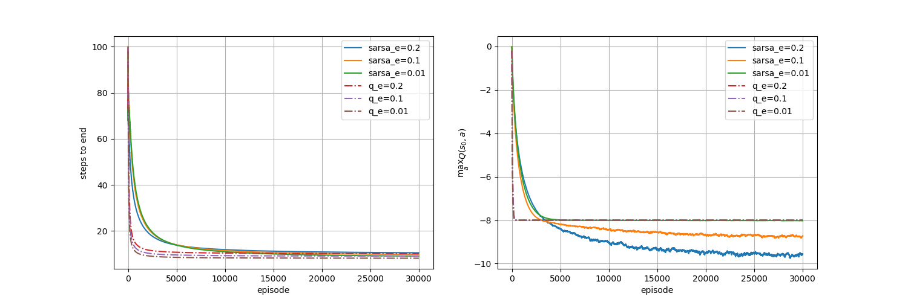
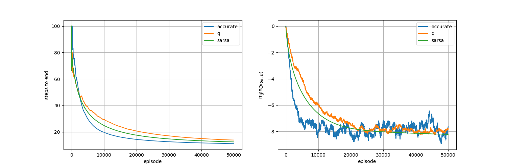
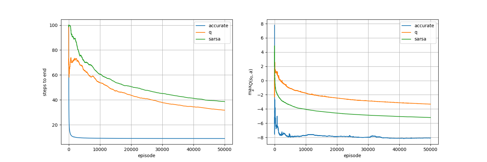
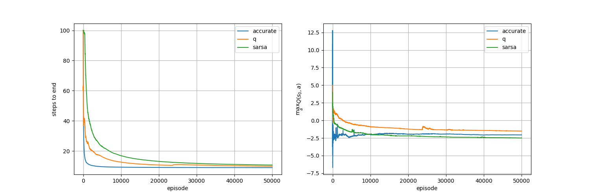

# Grid World

**固定不同的探索率（epsilon）下，Sarsa收敛的Q值是不同的**

> 学习率：0.1
>
> 

从图中看出，在*Q-Learning*中epsilon取值改变，初始状态的最大Q值不变，且收敛于真实值；但在*Sarsa*中epsilon取值改变，初始状态的最大Q值改变，且只有在epsilon较小时其值才收敛于真实值。
> 实验设置：***Grid Wold 5\*5***，**初始状态**：左上角(s_0)，**目标状态**：右下角(s_24)，每采取一个动作获得`-1`的奖赏。

**随机奖赏下的AQ、Q和Sarsa的对比**
> 学习率：0.001

> 衰减学习率：$ 1/(n(s,a)+1) $，$ n $为对应状态-动作对的访问次数
> 

*Q-Learning*和*Sarsa*在这样的设置下表现极差，大部分实验每个情节都使用了最大的步数，图中挑选了一次较好的实验结果。据分析，原因是这两种算法学习效率较低，在还未获得较好表现时，学习率已经非常小，这意味着表现将不会再有改进。

> 实验设置：***随机奖赏***，每采取一个动作获得的奖赏改变为`8或+6`，各有50%的几率（期望仍为`-1`），其他设置如前。

当改变奖赏设置：当到达目标状态时，获得`+5`的奖赏，其他如前，算法表现进步很大。

